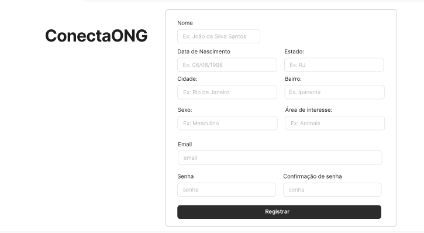

#  Projeto de Interface - ConectaOng

## Diagrama de Fluxo

O diagrama apresenta o estudo do fluxo de interação do usuário com o sistema interativo e  muitas vezes sem a necessidade do desenho do design das telas da interface. Isso permite que o design das interações seja bem planejado e gere impacto na qualidade no design do wireframe interativo que será desenvolvido logo em seguida.

## Wireframes

Cada tela apresentada no fluxo possui um Wireframe detalhado, disponível na plataforma Figma:

> [📌 Acesse o Wireframe Interativo no Figma](https://www.figma.com/design/ciYST6HKH0QDj7jo5Ltsbg/ConectaOng?node-id=0-1&p=f&t=Iyexzzs9k4ntBTnk-0)

Todas as telas compartilham uma estrutura padrão composta por três blocos:

- **Cabeçalho:** logo do ConectaOng e menu principal (menu “hambúrguer”).
   
- **Conteúdo:** área principal para interação e apresentação das informações.
   
- **Rodapé:** informações da equipe e contato.
    

## Telas do Sistema

### Home
Cabeçalho, Conteúdo e rodapé.

 

### Validação
Valida qual o tipo de registro

 
 
### Cadastro de Voluntário
Conteúdo: campos para preenchimento de "Nome", "CPF", "E-mail", "Senha", "Sexo", "Descrição" e botão de “Registrar”.

 

### Cadastro de ONG
Conteúdo: campos para preenchimento de "Título", "CNPJ", "Categoria", "Descrição", "Email", "Senha" e botão de “Registrar”.

 

### Login
Cabeçalho, Conteúdo e rodapé.

 

### Lista de Ongs
**Conteúdo:** tabela com detalhes de ongs cadastradas com Título, Descrição e Causa, Barra de pesquisa e filtros disponíveis.
  
 

 ### Lista de Voluntários
**Conteúdo:** tabela com nome de voluntários cadastrados, descrição e sexo.
  
 

### Suporte
**Conteúdo:** informações para contato do suporte técnico (telefone, WhatsApp e e-mail).

  

> **Links Úteis**:
> - [Protótipos vs Wireframes](https://www.nngroup.com/videos/prototypes-vs-wireframes-ux-projects/)
> - [Ferramentas de Wireframes](https://rockcontent.com/blog/wireframes/)
> - [MarvelApp](https://marvelapp.com/developers/documentation/tutorials/)
> - [Figma](https://www.figma.com/)
> - [Adobe XD](https://www.adobe.com/br/products/xd.html#scroll)
> - [Axure](https://www.axure.com/edu) (Licença Educacional)
> - [InvisionApp](https://www.invisionapp.com/) (Licença Educacional)
