# Template Padrão da Aplicação

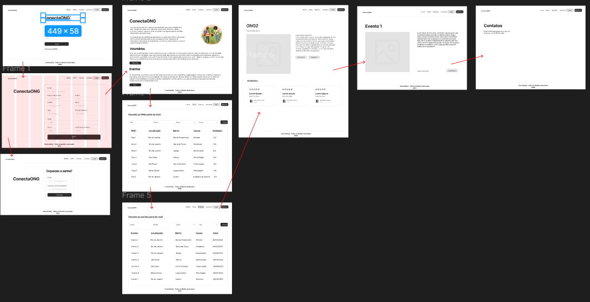

**Pré-requisitos:** [Especificação do Projeto](2-Especificação%20do%20Projeto.md), [Projeto de Interface](3-Projeto%20de%20Interface.md), [Metodologia](4-Metodologia.md)

## Identidade Visual

- **Paleta de cores:** [Especificação do Projeto](2-Especificação%20do%20Projeto.md).
- #2c2c2c, #282828, #e3e3e3 
- **Tipografia:** - Fontes principais detalhadas no [Projeto de Interface](3-Projeto%20de%20Interface.md).
- Family Inter, sans-serif
   **Títulos (H1, H2, H3)**: 32px, 24px, 28px.
   **Subtítulos**: 16px.
   **Texto padrão**: 14px.
- **Elementos gráficos:** Ícones padronizados, botões, campos e elementos interativos conforme o design system.

## Responsividade

- Layout totalmente responsivo para dispositivos móveis, tablets e desktops.
  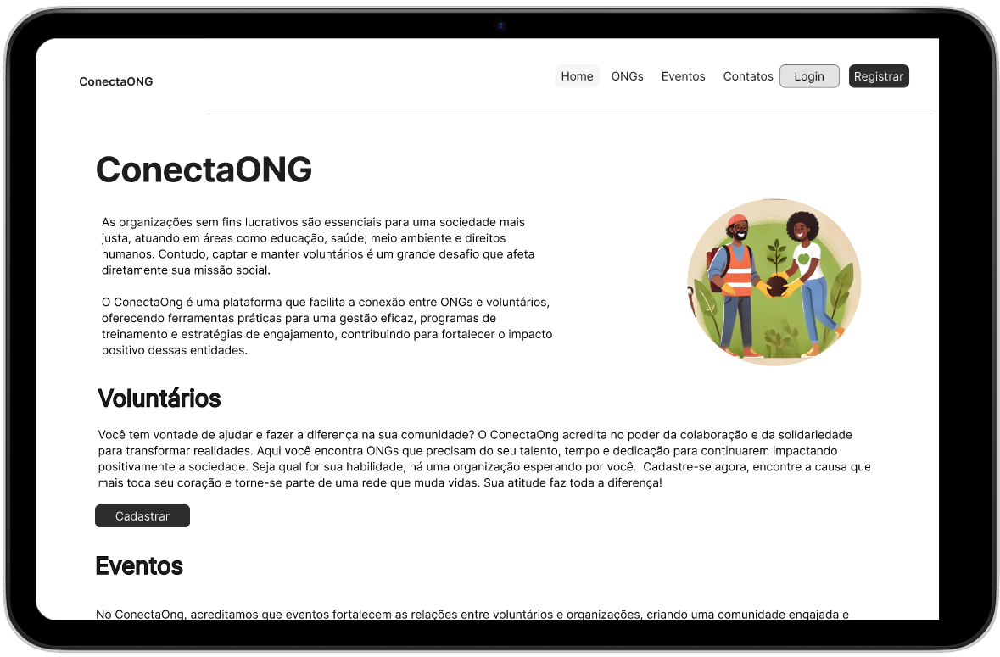
  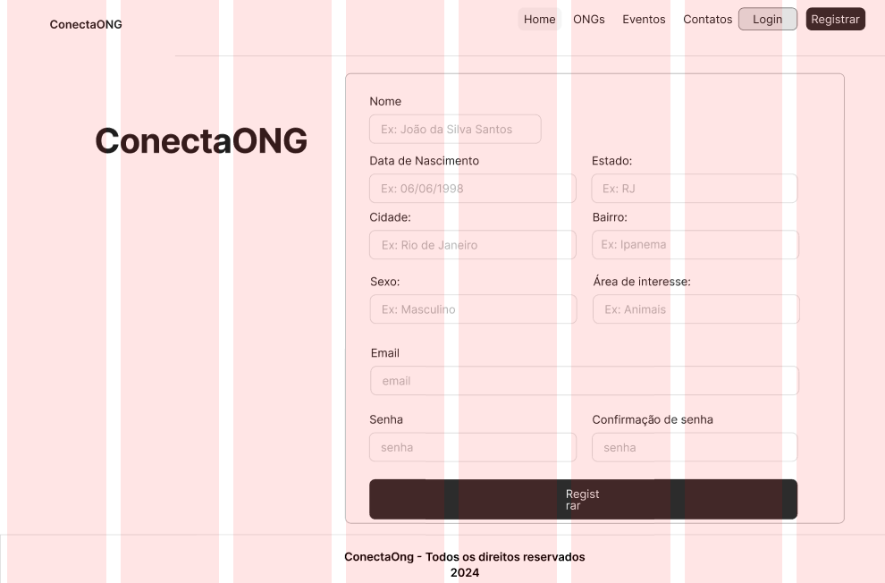

## Componentes

- **Cabeçalho padrão:** Logo e menu principal.
 
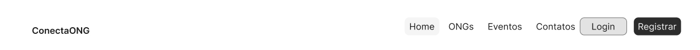
- **Rodapé:** Informações de contato, links úteis e créditos.
-  
- **Estrutura básica:** Seções padronizadas para títulos, subtítulos e conteúdos diversos.
 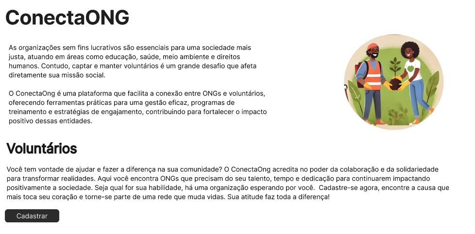

## Wireframes

Cada tela apresentada no fluxo possui um Wireframe detalhado, disponível na plataforma Figma:

> [📌 Acesse o Wireframe Interativo no Figma](https://www.figma.com/design/ciYST6HKH0QDj7jo5Ltsbg/ConectaOng?node-id=0-1&p=f&t=Iyexzzs9k4ntBTnk-0)

Todas as telas compartilham uma estrutura padrão composta por três blocos:

- **Cabeçalho:** logo do ConectaOng e menu principal (menu “hambúrguer”).
   
- **Conteúdo:** área principal para interação e apresentação das informações.
   
- **Rodapé:** informações da equipe e contato.
    

## Telas do Sistema

### Home
Cabeçalho, Conteúdo e rodapé.

 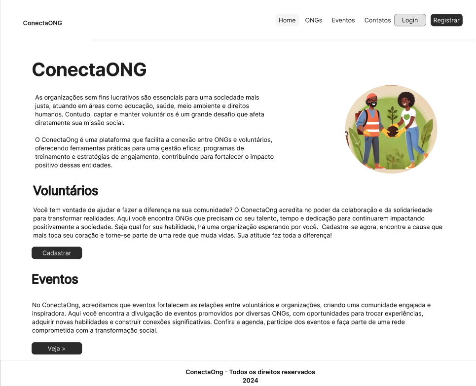

### Validação
Valida qual o tipo de registro

 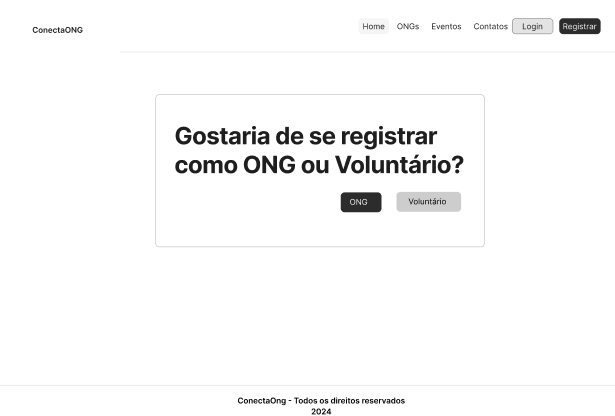
 
### Cadastro de Voluntário
Conteúdo: campos para preenchimento de "Nome", "CPF", "E-mail", "Senha", "Sexo", "Descrição" e botão de “Registrar”.

 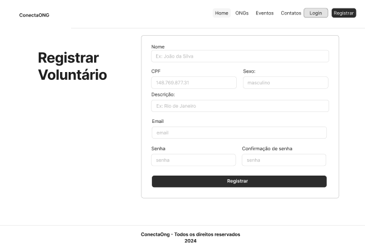

### Cadastro de ONG
Conteúdo: campos para preenchimento de "Título", "CNPJ", "Categoria", "Descrição", "Email", "Senha" e botão de “Registrar”.

 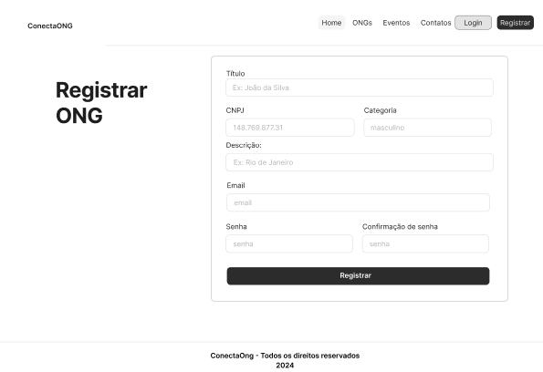

 ### Cadastro de Eventos
Conteúdo: campos para preenchimento de "Evento", "Descrição", "Data", "Local" e “Registrar”.

 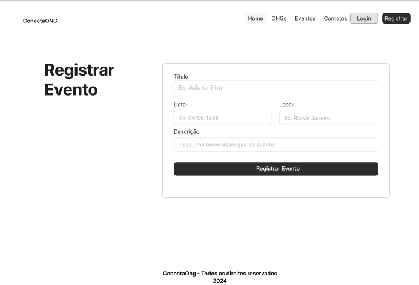

### Login
Cabeçalho, Conteúdo e rodapé.

 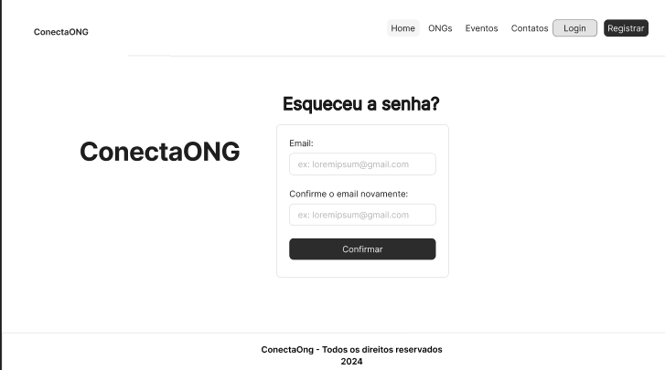

### Lista de Ongs
**Conteúdo:** tabela com detalhes de ongs cadastradas com Título, Descrição e Causa, barra de pesquisa e filtros disponíveis.
  
 

 ### Lista de Voluntários
**Conteúdo:** tabela com nome de voluntários cadastrados, descrição e sexo.
  
 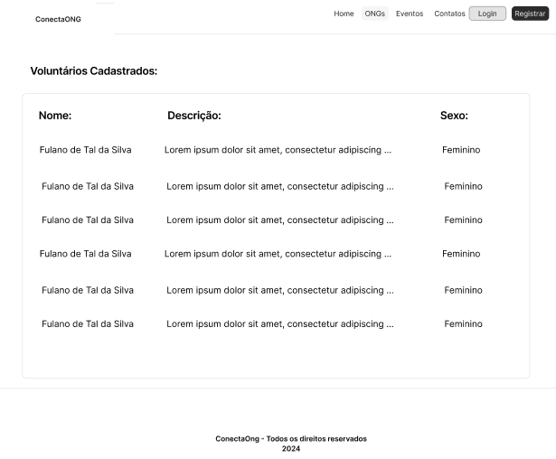

  ### Lista de Eventos
**Conteúdo:** tabela com nome de eventos cadastrados, descrição", data", "local" e  barra de pesquisa e filtros disponíveis.
  
 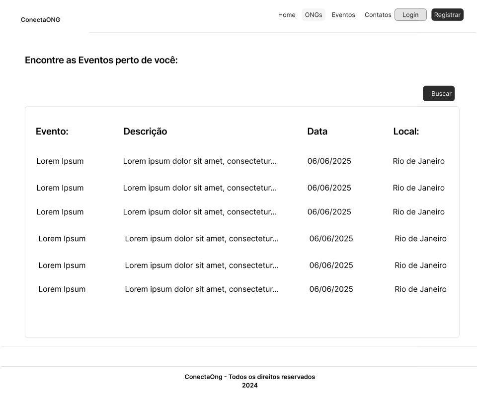

### Suporte
**Conteúdo:** informações para contato do suporte técnico (telefone, WhatsApp e e-mail).

  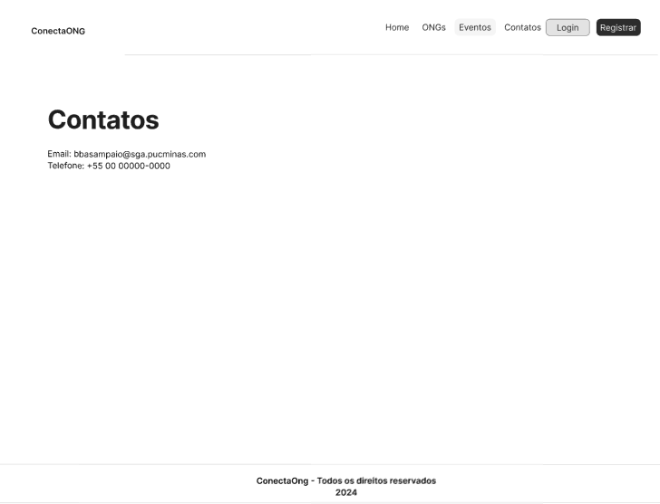

> **Links Úteis**:
> - [CSS Website Layout (W3Schools)](https://www.w3schools.com/css/css_website_layout.asp)
> - [Website Page Layouts](http://www.cellbiol.com/bioinformatics_web_development/chapter-3-your-first-web-page-learning-html-and-css/website-page-layouts/)
> - [Perfect Liquid Layout](https://matthewjamestaylor.com/perfect-liquid-layouts)
> - [How and Why Icons Improve Your Web Design](https://usabilla.com/blog/how-and-why-icons-improve-you-web-design/)
