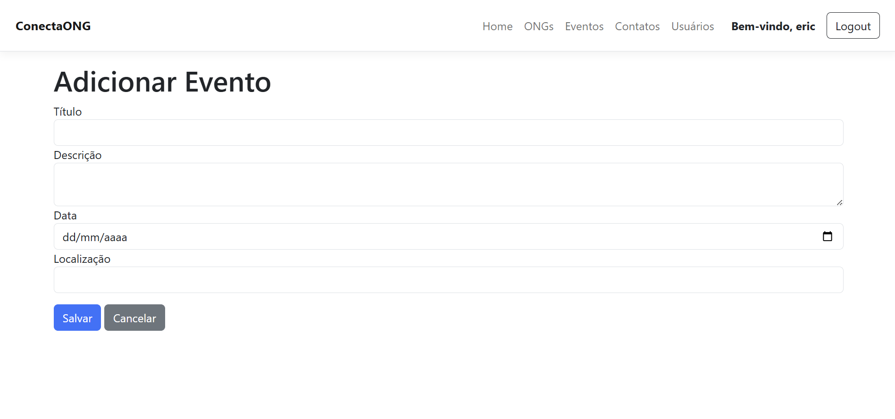
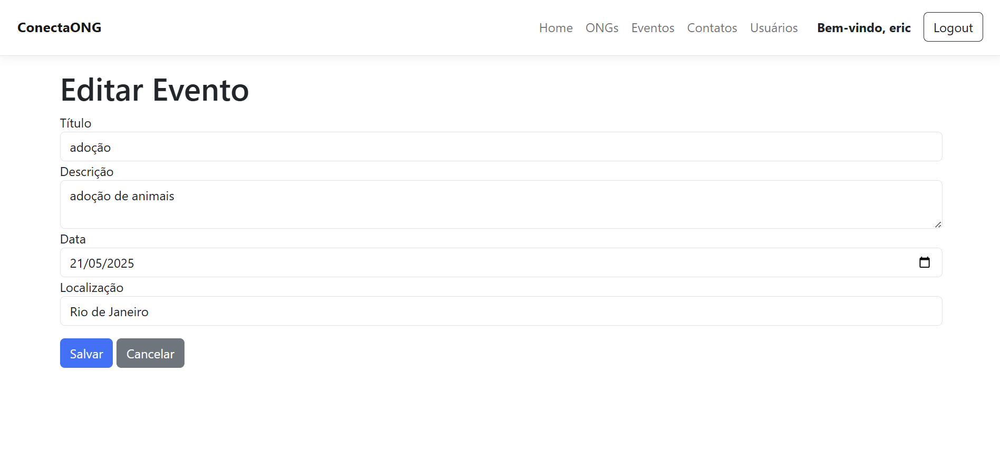
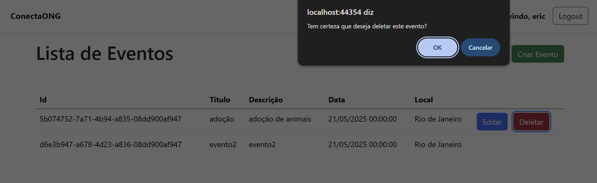

# Registro de Testes de Software

Pré-requisitos: <a href="3-Projeto de Interface.md"> Projeto de Interface</a>, <a href="8-Plano de Testes de Software.md"> Plano de Testes de Software</a>

Para cada caso de teste definido no Plano de Testes de Software, realize o registro das evidências dos testes feitos na aplicação pela equipe, que comprovem que o critério de êxito foi alcançado (ou não!!!). Para isso, utilize uma ferramenta de captura de tela que mostre cada um dos casos de teste definidos (obs.: cada caso de teste deverá possuir um vídeo do tipo _screencast_ para caracterizar uma evidência do referido caso).

| **Caso de Teste** 	| **CT01 – Realizar cadastro de uma ONG** 	|
|:---:	|:---:	|
|	Requisito Associado 	| RF-001 - O sistema deve permitir o cadastro de ONGs. |
|Registro de evidência |    [Assista ao video no YouTube](https://www.youtube.com/watch?v=eBByY-rgnv0)

 |

| **Caso de Teste** 	| **CT02 – Realizar edição de uma ONG** 	|
|:---:	|:---:	|
|	Requisito Associado 	| RF-002 - O sistema deve permitir a edição de ONGs |
|Registro de evidência |    [Assista ao video no YouTube](https://www.youtube.com/watch?v=pM5EvpPvExg)

|

| **Caso de Teste** 	| **CT03 – Exclusão de ONG** 	|
|:---:	|:---:	|
|	Requisito Associado 	|  RF-003 - O sistema deve permitir a exclusão de ONGs |
|Registro de evidência |   [Assista ao video no YouTube](https://www.youtube.com/watch?v=pM5EvpPvExg)

| **Caso de Teste** 	| **CT04 – Cadastro de Voluntario** 	|
|:---:	|:---:	|
|	Requisito Associado 	| RF-004 - O sistema deve permitir o cadastro de voluntários |
|Registro de evidência | [Assista o video](https://github.com/user-attachments/assets/e7a0f9fa-5ff9-4daa-b2ba-cdcb61ff8959) |

 | **Caso de Teste** 	| **CT-005 - Editar um Voluntário** 	|
|:---:	|:---:	|
|	Requisito Associado 	| RF-005 - O sistema deve permitir editar um voluntário |
|Registro de evidência | [Assista o video](https://github.com/user-attachments/assets/15aa372c-719a-42f4-bd8f-856b149af083) |

 | **Caso de Teste** 	| **CT-006 - Excluir um Voluntário** 	|
|:---:	|:---:	|
|	Requisito Associado 	| RF-006 - O sistema deve permitir a exclusão de voluntários |
|Registro de evidência | [Asista o video](https://github.com/user-attachments/assets/d4bbad00-b30b-4f4b-a18f-ac7f8311dedc) |

| **Caso de Teste** 	| **CT07 – Realizar cadastro de um Evento** 	|
|:---:	|:---:	|
|	Requisito Associado 	| RF-007 - O sistema deve permitir o cadastro de Eventos |
|Registro de evidência |   |

| **Caso de Teste** 	| **CT08 – Realizar edição de um Evento** 	|
|:---:	|:---:	|
|	Requisito Associado 	| RF-008 - O sistema deve permitir editar Eventos |
|Registro de evidência |  |

| **Caso de Teste** 	| **CT09 – Realizar deleção de um Evento** 	|
|:---:	|:---:	|
|	Requisito Associado 	| RF-009 - O sistema deve permitir a exclusão de Eventos |
|Registro de evidência |  |

| **Caso de Teste** 	| **CT12 – Compartilhamento de eventos via redes sociais** 	|
|:---:	|:---:	|
|	Requisito Associado 	| RF-012 - Compartilhamento de eventos via redes sociais |
|Registro de evidência | 
 |

## Relatório de testes de software

Apresente e discuta detalhadamente os resultados obtidos nos testes realizados, destacando tanto os pontos fortes quanto as fragilidades identificadas na solução. Explique como os aspectos positivos contribuem para o desempenho e a usabilidade do sistema, e como os pontos fracos impactam sua eficácia.

Descreva as principais falhas detectadas durante os testes, fornecendo exemplos concretos e evidências que sustentem essas observações. Explicite os impactos dessas falhas na experiência do usuário, na funcionalidade do sistema e nos objetivos do projeto.

Com base nessas análises, detalhe as estratégias que o grupo pretende adotar para corrigir as deficiências e aprimorar a solução nas próximas iterações. Inclua ações específicas, como ajustes no código, modificações na interface, otimizações de desempenho ou melhorias na acessibilidade e usabilidade.

Por fim, apresente e/ou proponha as melhorias a partir dos testes realizados, destacando os ganhos obtidos e como essas alterações contribuem para a evolução do projeto.

> **Links Úteis**:
> - [Ferramentas de Test para Java Script](https://geekflare.com/javascript-unit-testing/)
