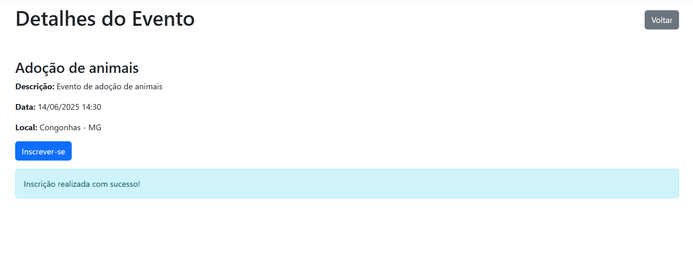

# Registro de Testes de Software

Pré-requisitos: <a href="3-Projeto de Interface.md"> Projeto de Interface</a>, <a href="8-Plano de Testes de Software.md"> Plano de Testes de Software</a>

Para cada caso de teste definido no Plano de Testes de Software, realize o registro das evidências dos testes feitos na aplicação pela equipe, que comprovem que o critério de êxito foi alcançado (ou não!!!). Para isso, utilize uma ferramenta de captura de tela que mostre cada um dos casos de teste definidos (obs.: cada caso de teste deverá possuir um vídeo do tipo _screencast_ para caracterizar uma evidência do referido caso).

| **Caso de Teste** 	| **CT01 – Realizar cadastro de uma ONG** 	|
|:---:	|:---:	|
|	Requisito Associado 	| RF-001 - O sistema deve permitir o cadastro de ONGs. |
|Registro de evidência |    [Assista ao video no YouTube](https://www.youtube.com/watch?v=eBByY-rgnv0)

 |

| **Caso de Teste** 	| **CT02 – Realizar edição de uma ONG** 	|
|:---:	|:---:	|
|	Requisito Associado 	| RF-002 - O sistema deve permitir a edição de ONGs |
|Registro de evidência |    [Assista ao video no YouTube](https://www.youtube.com/watch?v=pM5EvpPvExg)

|

| **Caso de Teste** 	| **CT03 – Exclusão de ONG** 	|
|:---:	|:---:	|
|	Requisito Associado 	|  RF-003 - O sistema deve permitir a exclusão de ONGs |
|Registro de evidência |   [Assista ao video no YouTube](https://www.youtube.com/watch?v=pM5EvpPvExg)

| **Caso de Teste** 	| **CT04 – Cadastro de Voluntario** 	|
|:---:	|:---:	|
|	Requisito Associado 	| RF-004 - O sistema deve permitir o cadastro de voluntários |
|Registro de evidência | [Assista o video](https://github.com/user-attachments/assets/e7a0f9fa-5ff9-4daa-b2ba-cdcb61ff8959) |

 | **Caso de Teste** 	| **CT-005 - Editar um Voluntário** 	|
|:---:	|:---:	|
|	Requisito Associado 	| RF-005 - O sistema deve permitir editar um voluntário |
|Registro de evidência | [Assista o video](https://github.com/user-attachments/assets/15aa372c-719a-42f4-bd8f-856b149af083) |

 | **Caso de Teste** 	| **CT-006 - Excluir um Voluntário** 	|
|:---:	|:---:	|
|	Requisito Associado 	| RF-006 - O sistema deve permitir a exclusão de voluntários |
|Registro de evidência | [Asista o video](https://github.com/user-attachments/assets/d4bbad00-b30b-4f4b-a18f-ac7f8311dedc) |

| **Caso de Teste** 	| **CT07 – Realizar cadastro de um Evento** 	|
|:---:	|:---:	|
|	Requisito Associado 	| RF-007 - O sistema deve permitir o cadastro de Eventos |
|Registro de evidência |   |

| **Caso de Teste** 	| **CT08 – Realizar edição de um Evento** 	|
|:---:	|:---:	|
|	Requisito Associado 	| RF-008 - O sistema deve permitir editar Eventos |
|Registro de evidência |  |

| **Caso de Teste** 	| **CT09 – Realizar deleção de um Evento** 	|
|:---:	|:---:	|
|	Requisito Associado 	| RF-009 - O sistema deve permitir a exclusão de Eventos |
|Registro de evidência |  |

| **Caso de Teste** 	| **CT10 – O sistema deve permitir que os voluntários se inscrevam em eventos de seu interesse** 	|
|:---:	|:---:	|
|	Requisito Associado 	| RF-007 - O sistema deve permitir a inscrição de voluntários em eventos |
|Registro de evidência |  |

| **Caso de Teste** 	| **CT12 – Compartilhamento de eventos via redes sociais** 	|
|:---:	|:---:	|
|	Requisito Associado 	| RF-012 - Compartilhamento de eventos via redes sociais |
|Registro de evidência | 
 |

## Relatório de testes de software
Intruções:
Apresente e discuta detalhadamente os resultados obtidos nos testes realizados, destacando tanto os pontos fortes quanto as fragilidades identificadas na solução. Explique como os aspectos positivos contribuem para o desempenho e a usabilidade do sistema, e como os pontos fracos impactam sua eficácia.

Descreva as principais falhas detectadas durante os testes, fornecendo exemplos concretos e evidências que sustentem essas observações. Explicite os impactos dessas falhas na experiência do usuário, na funcionalidade do sistema e nos objetivos do projeto.

Com base nessas análises, detalhe as estratégias que o grupo pretende adotar para corrigir as deficiências e aprimorar a solução nas próximas iterações. Inclua ações específicas, como ajustes no código, modificações na interface, otimizações de desempenho ou melhorias na acessibilidade e usabilidade.

Por fim, apresente e/ou proponha as melhorias a partir dos testes realizados, destacando os ganhos obtidos e como essas alterações contribuem para a evolução do projeto.

> **Links Úteis**:
> - [Ferramentas de Test para Java Script](https://geekflare.com/javascript-unit-testing/)
>

### Relatório
✅ CT01 – Realizar cadastro de uma ONG  
Resultado: Teste bem-sucedido. O sistema permitiu o cadastro completo de uma ONG com todos os campos obrigatórios.  
Ponto forte: A validação dos campos funcionou corretamente, impedindo envio com campos vazios.    
Melhoria sugerida: Adicionar uma verificação de CNPJ mais precisa, pois atualmente aceita alguns formatos inválidos.  
Ação futura: Incluir uma validação extra do CNPJ com regex e integração com base pública para verificação, além de incluir um toast de sucesso informando que deu tudo certo com o registro.  

✅ CT02 – Realizar edição de uma ONG  
Resultado: Teste bem-sucedido. A funcionalidade de edição carregou os dados corretamente e permitiu a atualização sem erros.  
Ponto forte: O formulário pré-preenche os dados da ONG de forma rápida e responsiva.  
Ação futura: Melhorar a visibilidade do feedback visual, confirmando antes de editar uma informação e mostrando mensagem de sucesso ao salvar as alterações.  

✅ CT03 – Exclusão de ONG  
Resultado: Teste realizado com sucesso. A ONG foi excluída após a confirmação.  
Melhoria sugerida: Adicionar uma mensagem de confirmação antes de permitir a exclusão da ONG.  
Ação futura: Adicionar toasts de confirmação, informando sobre as ações dos usuários.  

✅ CT04 – Cadastro de Voluntário  
Resultado: Teste concluído com sucesso. Cadastro realizado com todos os campos preenchidos.  
Ponto forte: Campos intuitivos, formulário acessível e responsivo.  
Fragilidade: Não há verificação de duplicidade de CPF ou e-mail, não é possível adicionar um CPF com formatação.  
Ação futura: Adicionar checagem de duplicidade antes do envio do formulário para evitar dados repetidos no banco. Além disso adicionar validacao de CPF com os numeros formatados (000.000.000-00), atualmente só é possível apenas com números.  

✅ CT05 – Edição de Voluntário  
Resultado: Teste bem-sucedido. Voluntário editado com sucesso.  
Ponto forte: Interface simples e clara para edição.  
Falha detectada: Campo de CPF aceita qualquer caractere, inclusive letras.  
Ação futura: Adicionar input type="number" com máscara e validação regex para CPF.

✅ CT06 – Exclusão de Voluntário  
Resultado: Teste bem-sucedido. Voluntário excluído com sucesso.  
Ponto forte: Fluxo semelhante ao da exclusão de ONG, apenas o usuário que está logado tem acesso ao botão de exclusão.  
Fragilidade: Mesma de ONG, falta mensagens de confirmação. Além disso, após excluir um voluntário o logout não é feito automaticamente, e ao tentar clicar no perfil do voluntário novamente apresenta um erro.  
Ação futura: Adcicionar mensagens de confirmação e toast de sucesso e erro, além disso fazer o logout do usuário após a exclusão. 

✅ CT07 – Realizar cadastro de um evento  
Resultado: Teste realizado com sucesso. O sistema permitiu o cadastro de um novo evento ao preencher todos os campos corretamente.  
Ponto forte: O formulário é intuitivo e responsivo. O campo de data utiliza um componente de calendário, que facilita a seleção de datas de forma prática e visual.  
Fragilidade: Ao deixar a descrição em branco ou incompleta, o sistema lança uma exception em vez de exibir uma mensagem de validação. Ao inserir uma data no passado, não há um alerta — o sistema redireciona o usuário para fora da tela de eventos.  
Ação futura: Implementar tratamento de erro para campos obrigatórios, exibindo mensagens claras ao usuário. Incluir validação de data para impedir eventos com datas anteriores e manter o usuário na tela em caso de erro, exibindo um alerta.  

✅ CT08 – Realizar edição de um evento  
Resultado: Teste realizado com sucesso. Foi possível editar os dados de um evento existente.  
Ponto forte: O formulário é pré-preenchido com os dados atuais do evento e o campo de data continua utilizando o calendário interativo.   
Fragilidade: Ao deixar um ou mais campos em branco, o sistema dispara uma exception sem apresentar uma mensagem de erro ao usuário. Ao alterar a data para um valor passado, o sistema retira o usuário da tela de edição e exclui o evento da lista de eventos cadastrados, comportamento semelhante ao observado no CT07.  
Ação futura: Implementar tratamento de erro com mensagens para campos obrigatórios. Adicionar validação para impedir seleção de datas passadas. Corrigir o comportamento inesperado que remove o evento sem confirmação, mantendo o usuário na tela de edição em caso de erro.  

✅ CT09 – Realizar deleção de um evento  
Resultado: Teste realizado com sucesso. Foi possível realizar a deleção de um evento existente.  
Ponto forte: Um toast de confirmação é exibido e a lista de eventos é atualizada. O botão de exclusão aparece apenas para a ONG responsável pelo evento.  
Fragilidade: Atualmente, o botão de deletar só está disponível na lista de eventos cadastrados. Para melhorar a usabilidade, seria ideal que esse botão também estivesse acessível na aba de edição do evento.  
Ação futura: Adicionar o botão de deleção na tela de edição de evento, permitindo que a ONG responsável possa excluir diretamente ao editar, sem precisar voltar à lista de eventos cadastrados.  

✅ CT10 – Realizar inscrição de voluntário em evento  
Resultado: Teste realizado com sucesso. Foi possível realizar a inscrição em um evento como voluntário.  
Ponto forte: O sistema impede que o voluntário se inscreva duas vezes no mesmo evento, exibindo uma mensagem clara ao tentar repetir a inscrição.  
Fragilidade: É possível se inscrever em dois eventos que ocorrem no mesmo dia e horário, sem um alerta ou restrição.  
Melhoria sugerida: Alterar o texto do botão para “Inscrito” após a inscrição bem-sucedida, para indicar o status do usuário no evento.  
Ação futura: Implementar verificação para avisar sobre conflitos de dia e horário entre eventos no momento da inscrição e atualizar dinamicamente o texto do botão para refletir o status do voluntário.  

✅ CT12 – Compartilhamento de eventos via redes sociais  
Resultado: Teste realizado com sucesso. Foi possível realizar o compartilhamento de eventos nas redes sociais.  
Ponto forte: Ao clicar no botão “Compartilhar um Evento”, é possível escolher qual evento deseja compartilhar e em qual rede social.   
Melhoria sugerida: Atualmente, o link enviado direciona para a página de lista de eventos cadastrado, e não para a tela de detalhes do evento específico compartilhado.  
Ação futura: Ajustar o link gerado para que direcione diretamente para a página de detalhes do evento selecionado.  

